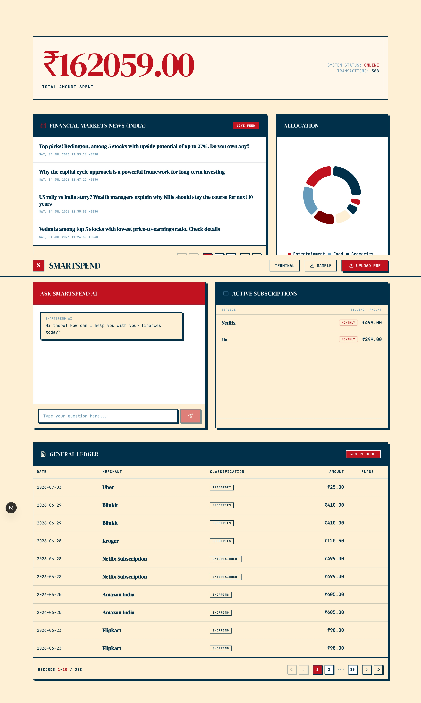
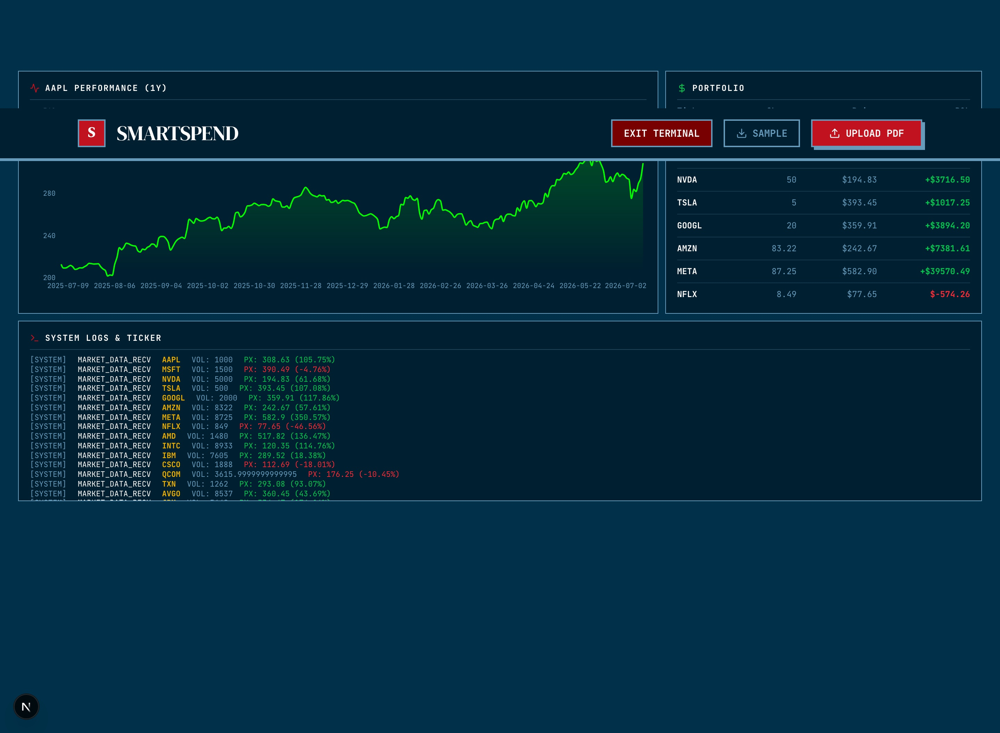

# 💰 SmartSpend AI

> *Stop wondering where your money went. Start asking it.*

SmartSpend AI is a full-stack intelligent financial assistant that turns your messy PDF bank statements into structured, actionable insights — in seconds. Drag and drop your statement, and start chatting with your own data.

<br/>

<br/>

## 📸 Screenshots

### Dashboard



### Terminal Mode


<br/>

## ✨ Features

### 🧠 Hybrid PDF Parsing Engine
Bank PDFs come in every format imaginable. SmartSpend handles them all:
- **Regex** extraction for structured fields (dates, amounts, descriptions)
- **LLM fallback** for non-standard, poorly-formatted statements
- Processes 80+ transactions in real-time with a live progress indicator

### 🤖 Custom ML Transaction Classifier
A Random Forest Classifier (Scikit-Learn) trained on real transaction descriptions:
- `"SWIGGY ORDER #1234"` → **Food & Dining**
- `"AMZN MKTP US*1A2B"` → **Shopping**
- `"UBER TRIP"` → **Transport**
- Detects anomalies and duplicate charges automatically

### 💬 RAG-Powered Financial Chatbot
Ask natural language questions about your spending, powered by **Google Gemini**:
- *"How much did I spend on Swiggy this month?"*
- *"Any suspicious transactions in November?"*
- *"What are my recurring subscriptions?"*
- Streaming responses with real-time token output

### 📊 Rich Analytics Dashboard
- Monthly **spending trend** area chart
- **Category breakdown** with visual bars
- **Subscription tracker** — auto-detects Netflix, Spotify, Jio, etc.
- **Portfolio tracker** with live stock data via yfinance
- **ET Markets financial news** feed

<br/>

## 🛠️ Tech Stack

| Layer | Technology |
|---|---|
| **Frontend** | Next.js 15 (App Router) · Tailwind CSS · Recharts · Framer Motion |
| **Backend** | Flask · SQLAlchemy · Celery · Flask-Limiter · Flask-Caching |
| **ML Engine** | Scikit-Learn · Pandas · Random Forest Classifier |
| **GenAI** | Google Gemini API (RAG + streaming) |
| **Database** | SQLite (dev) · PostgreSQL (prod) |
| **Infrastructure** | Docker · Docker Compose · Terraform · Render · Vercel |

<br/>

## ⚡ Quick Start

### Prerequisites
- Python 3.11+
- Node.js 18+
- A [Google Gemini API key](https://aistudio.google.com/)

### 1. Clone the repo
```bash
git clone https://github.com/Shabbirh10/SmartSpend-AI.git
cd SmartSpend-AI
```

### 2. Set up environment
```bash
# Backend
cp backend/.env.example backend/.env
# Edit backend/.env and add your GEMINI_API_KEY
```

### 3. One-command startup
```bash
chmod +x start_app.sh
./start_app.sh
```

This script will:
- Create a Python virtual environment
- Install all backend dependencies
- Train the ML classifier
- Initialize the database
- Start the Flask backend on `http://localhost:8000`
- Install frontend packages and start Next.js on `http://localhost:3000`

### 4. Try the demo
- Open `http://localhost:3000`
- Click **"Sample PDF"** in the top right to download a realistic fake bank statement
- Upload it and watch 80+ transactions get parsed, classified, and analyzed in real-time

<br/>

## 🐳 Docker (one command)

```bash
docker compose up --build
```

| Service | URL |
|---|---|
| Frontend | http://localhost:3000 |
| Backend API | http://localhost:8000/health |

<br/>

## 🌐 Deploy

This repo is structured for clean deployment as two independent services.

### Backend → Render
1. Create a **Web Service** pointing to the `backend/` directory
2. **Build command:** `pip install -r requirements.txt`
3. **Start command:** `PYTHONPATH=.. python init_db.py && PYTHONPATH=.. gunicorn -w 2 -b 0.0.0.0:$PORT wsgi:app`
4. Add environment variable: `GEMINI_API_KEY` = your key

### Frontend → Vercel
1. Import the `frontend/` directory as a Vercel project
2. Add environment variable: `NEXT_PUBLIC_API_URL` = `https://<your-render-service>.onrender.com/api`

<br/>

## 🔮 Roadmap

- [ ] Multi-statement trend analysis (compare months/quarters)
- [ ] Budget alerts & spending limits
- [ ] Support for more PDF formats (HDFC, ICICI, SBI)
- [ ] Export to CSV / Excel

<br/>

---

*Built by [Shabbir Hardwarewala](https://github.com/Shabbirh10)*
